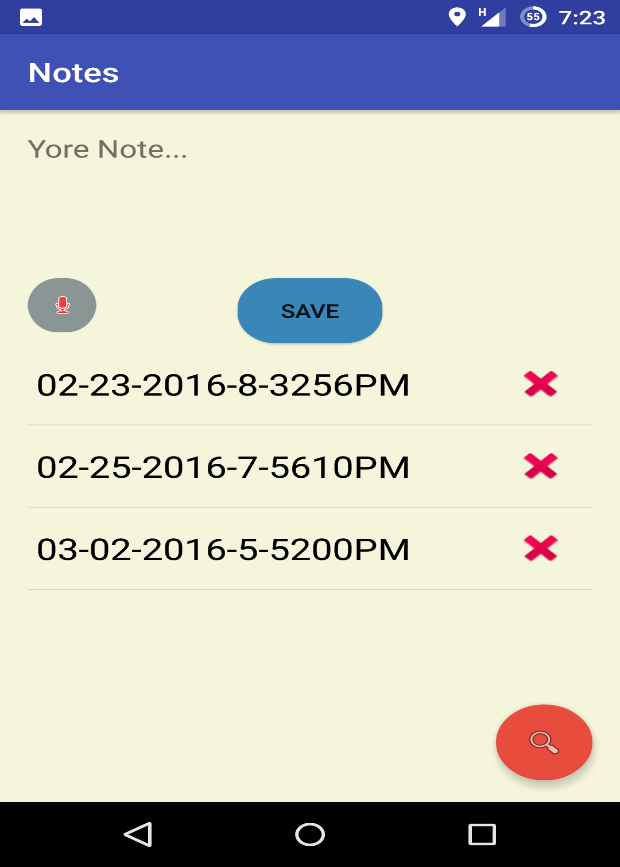

# SafeApp

The app that let use your smartphone while driving.

SafeApp it's an android app that use the multimodality approach to give the driver safer solution.

## Background
Due to the mobile revolution, people tend to use their smartphone while driving there car,
browsing the web, sending text message, making calls and more.
This puts the driver's safety at risk.

## Featurs
- Make phonecalls
- Send SMS
- Take a note
- Weather information
- Current speed
- Control Media

## Screenshots

 

 
 
 
 
 

 
> The app built with JAVA in android studio, and using SQLite for connecting local DB to save some informaton such as contacts,places. 

 
 
 
 
 
 
 